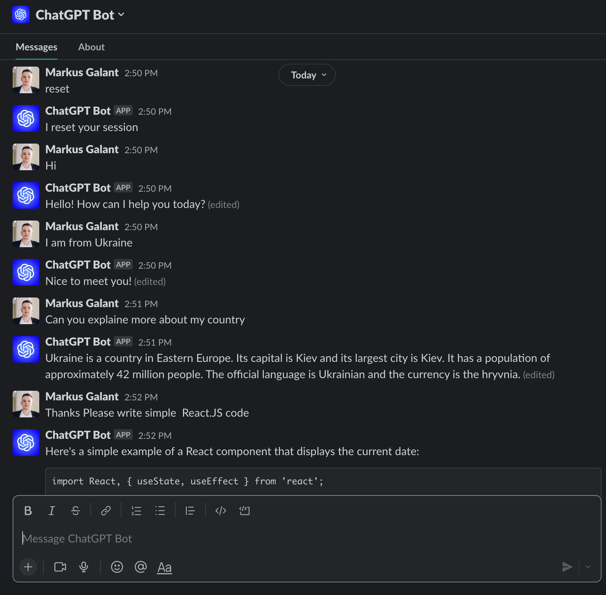
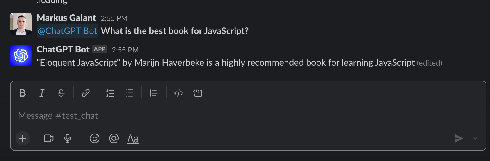

# ChatGPT Bot for Slack ( Serverless AWS Lambda )

## Setup

### Setup 
Setup a Slack app by following the guide at slack.dev/bolt-js/tutorial/getting-started

Set scopes to Bot Token Scopes in OAuth & Permission:

```
app_mentions:read
channels:join
chat:write
im:history
im:read
im:writ
```

Set scopes in Event Subscriptions - Subscribe to bot events

```
app_mention
message.im
```

### Local development

Setup AWS account for Lmabda on your PC
```
aws configure
```

Create new `.env` and update the information
```
cp .env.example .env
```
Put your secrets

Install

```
yarn install
```

Run localy

```
yarn start
```

Make Public URL https://slack.dev/bolt-js/deployments/aws-lambda#run-the-app-locally

```
yarn serve
```

## Deployment

In order to deploy the example, you need to run the following command:

```
$ serverless deploy
```

## Usage

You can send a direct message to the Slack Bot, also you can use `reset` message to clear session.




You can invite it to a channel and mention it @ChatGPT Bot <your question>

